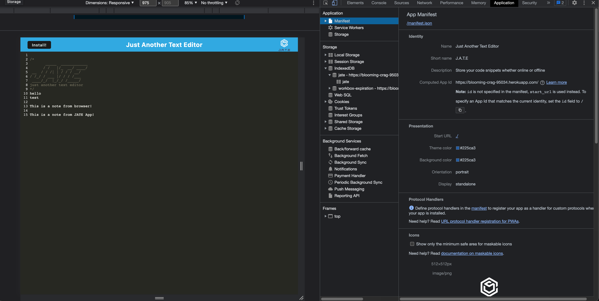

# Text-Editor


## Description

JATE, short for "Just Another Text Editor," is a simple and user-friendly text editor designed to cater to the basic text editing needs of individuals, students, and professionals alike. The goal of this project is to provide a lightweight and easy-to-use alternative to complex text editing software, allowing users to quickly and efficiently create, edit, and save their textual content.

To develop JATE, we leveraged modern web technologies, including JavaScript, HTML, and CSS. For storage, we used the IndexedDB browser database to save the content locally, allowing users to persist their work even after closing their browser or navigating away from the page. Additionally, we utilized the webpack bundler for efficient code organization and deployment, as well as Node.js and Express for server-side functionality.

During the development process, we encountered several challenges, including difficulties with IndexedDB implementation and storage. Initially, the content was not being saved correctly in the database, which required us to delve deeper into the IndexedDB API and understand its intricacies. By refining our implementation and modifying our storage strategy, we successfully resolved the issue and enabled reliable content storage.

Another problem we faced was deploying the application to Heroku, as the build process failed due to missing dependencies. We solved this by ensuring that all required dependencies, such as webpack and webpack-cli, were properly listed in the package.json file and correctly referenced in the build script.

Throughout this project, we gained valuable insights and expanded our knowledge in various areas, including the implementation and management of browser-based databases, and the deployment process for web applications on platforms like Heroku. Moreover, we honed our problem-solving skills by troubleshooting and resolving the aforementioned challenges.

In conclusion, JATE is a lightweight and efficient text editor that leverages modern web technologies to provide a seamless user experience. The challenges faced and lessons learned during its development have contributed to our growth as developers and our understanding of the intricacies of web application development.


## Table of Content

* [Installation](#installation)
* [Usage](#usage)
* [Contribution](#contribution)
* [License](#license)
  
## Made With


  
## Installation  

```
npm install
npm run start
```

## Usage

To view this application,the following image shows the landing page of the application, or click on the page link that demonstrates the functionality of this project:\
<https://blooming-crag-95034.herokuapp.com/>

APP installation:


Web page and APP interface:


Application console:


Manifest.json:


Registered service worker:


IndexedDB:


## License


Link to license: <https://opensource.org/licenses/MIT>

```
Copyright (C) 2023 Gary GAO

Permission is hereby granted, free of charge, to any person obtaining a copy of this software and associated documentation files (the "Software"), to deal in the Software without restriction, including without limitation the rights to use, copy, modify, merge, publish, distribute, sublicense, and/or sell copies of the Software, and to permit persons to whom the Software is furnished to do so, subject to the following conditions:

The above copyright notice and this permission notice shall be included in all copies or substantial portions of the Software.

THE SOFTWARE IS PROVIDED "AS IS", WITHOUT WARRANTY OF ANY KIND, EXPRESS OR IMPLIED, INCLUDING BUT NOT LIMITED TO THE WARRANTIES OF MERCHANTABILITY, FITNESS FOR A PARTICULAR PURPOSE AND NONINFRINGEMENT. IN NO EVENT SHALL THE AUTHORS OR COPYRIGHT HOLDERS BE LIABLE FOR ANY CLAIM, DAMAGES OR OTHER LIABILITY, WHETHER IN AN ACTION OF CONTRACT, TORT OR OTHERWISE, ARISING FROM, OUT OF OR IN CONNECTION WITH THE SOFTWARE OR THE USE OR OTHER DEALINGS IN THE SOFTWARE.
  
```
  
## Contribution

Thanks to the starter code provided by BootCamp.

## Tests

```
N/A
```

## Questions

N/A

## Contact

* For any question about this project, please email me at: gary.yanggao@gmail.com
* To see more of my projects, follow me on Github at: <http://github.com/Mid30s>
  
[](mailto:gary.yanggao@gmail.com)
[](https://github.com/Mid30s)
